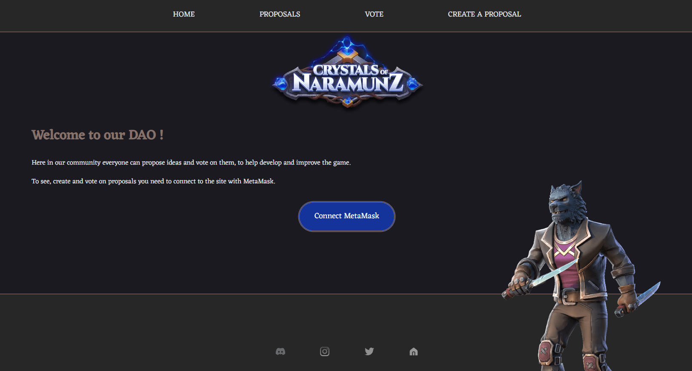

# Naramunz_DAO

Welcome to the Naramunz Decentralized Autonomous Organization (DAO), a project that brings blockchain technology to the world of RPG games. This project contains two primary components: **naramunz_contract** and **naramunz_frontend**.
The Naramunz DAO empowers users to generate proposals and cast their votes.

The aim of the project is to encouraging community engagement and decision-making within the game world. Decentralized governance for the Naramunz community is an attempt to ensure inclusivity and collective decision making in the game, which adds value by democratizing several key areas of the gaming industry.

This project is made as a learning process and part of a school assignment. Please ensure that the code aligns with your requirements and meets your security standards if you choose to use it.

## Naramunz_contract

The naramunz_contract directory contains smart contracts, created with Solidity and Foundry https://book.getfoundry.sh/ and deploys on Sepholia testnet. It uses the OpenZeppelin library to implement the ERC721 standard for non-fungible tokens (NFTs).

**Features & functions**

`createProposal` Creates a new proposal. The user must be the owner of the ERC721 token that is used for creating a proposal. Each proposal includes a title, a description, and a number of 'yes' and 'no' votes.  
`vote` Allows the user to vote on a specific proposal. The user must be the owner of the ERC721 token that is used for voting on a proposal.  
`getProposals` Returns all proposals.

## Naramunz_frontend

The naramunz_frontend directory contains the React application that serves as the user interface for the DAO and allows users to interact with the smart contracts.

**Features & functions**

`connectToMetaMask` Allows users to connect their MetaMask wallets to the application.  
`fetchProposals` Fetches all proposals from the DAO and displays them.  
`createProposal` Users can create new proposals.  
`voteonProposal` Users can vote on existing proposals.

# Installation

To get started with this project, follow these steps:

Clone this repo to your local machine.

## Naramunz_contract

### Dependencies:

Navigate to the naramunz_contract directory and run the following command: `npm install @openzeppelin/contracts` in the terminal.

---

If you want to redeploy this contract, you need to set up a .env file with your PRIVATE_KEY and SEPHOLIA_RPC_URL. These are required for the deployment process. For the Sepholia RPC URL, you can use Alchemy node as a server https://www.alchemy.com/ and set up an application to obtain the RPC URL.

**IMPORTANT!** Remember to use a **dummy private key**, never expose one that has any value attached.

To deploy the contract, use the following command: `source .env` `forge script script/DeployDAO.s.sol --rpc-url $SEPHOLIA_RPC_URL --private-key $PRIVATE_KEY --broadcast`

After deploying the contract, remember to update the DAO_ADDRESS in the config.js file in the **naramunz_frontend** folder with the new contract address.

Please note that you don't need to redeploy this contract in order to test and explore its functions.

---

To run test: `forge test` or `forge test --vvv` for more information.

## Naramunz_frontend

### Dependencies:

Before running this project, ensure that the following dependencies are installed:

react: version ^18.2.0
react-dom: version ^18.2.0
react-router-dom: version ^6.21.1
react-scripts: version 5.0.1
web3: version ^4.3.0

To install these dependencies, navigate to the naramunz_frontend directory and run the following command:
`npm install react@^18.2.0 react-dom@^18.2.0 react-router-dom@^6.21.1 react-scripts@5.0.1 web3@^4.3.0`

To start the application, run the following command:
`npm start`
The application will then be available at http://localhost:3000.

Please note that this application requires MetaMask to be installed and connected to the Sepholia testnet, and containing Sepholia ETH.

## License

This project is licensed under the MIT License. See the [LICENSE](./LICENSE) file for details.
